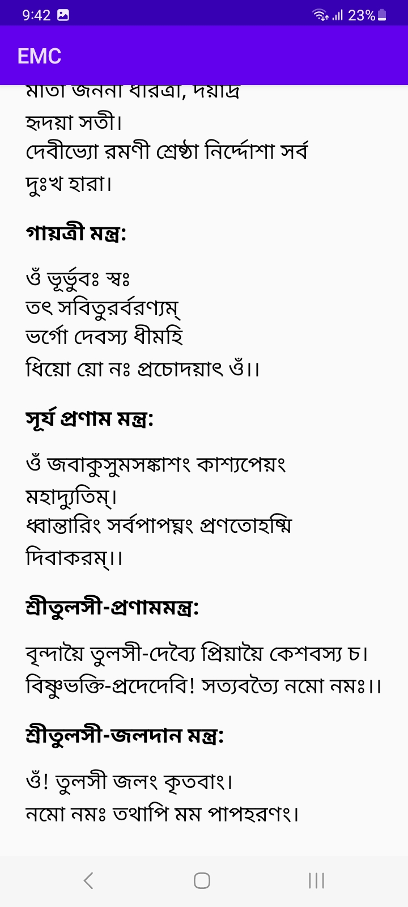
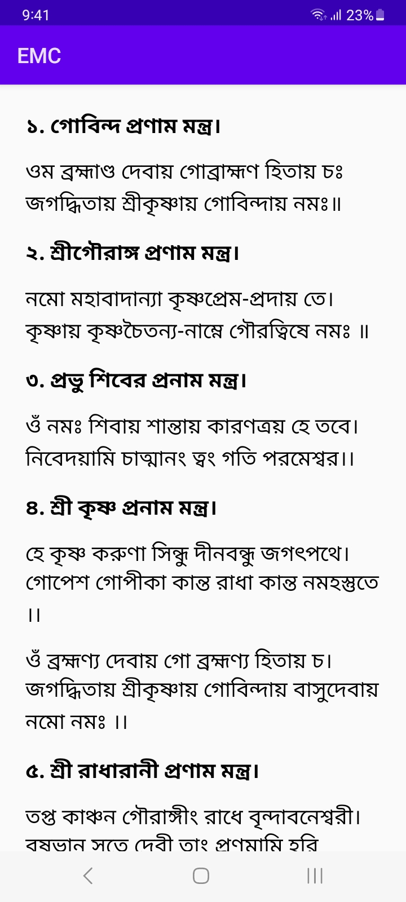

# What is this  repository?
This is official emc download page source code.
Help us to develop EMC.
# What is EMC?
Hidu God and Goddess Mantras

Discover a powerful collection of over 20 Hindu god and goddess pro-am mantras with EM.apk. Designed for Android 12 and up, this lightweight app (just 53KB) provides an offline experience, allowing you to chant and meditate without internet connectivity.

Immerse yourself in the spiritual essence of these mantras, presented in Bengali for easy understanding. Perfect for daily practice, this app serves as a companion for devotion and tranquility, making it a must-have for spiritual seekers and devotees alike. Download EM.apk and enhance your spiritual journey today!

# Download Link
* Download from **[Our Server](emc.apk)**
* Download from **[Upload Apk](https://www.upload-apk.com/hQsBBel9nPb2q7p)**
* Download PDF Versions from **[Our Server](/emc.pdf)**
# Screenshot

